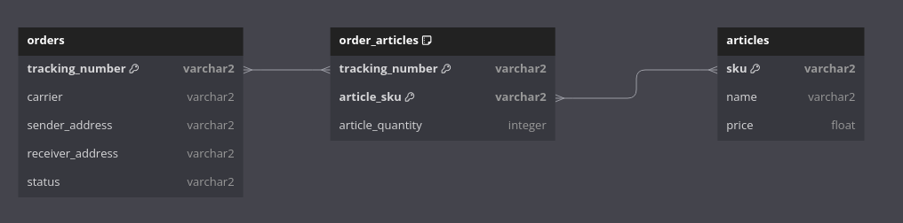

# Track and Trace Api

## Set up virtual environment

Setup pyton virtual environment with version 3.11 e.g.,
using [virtualenvwrapper](https://virtualenvwrapper.readthedocs.io/en/latest)

```shell 
mkvirtualenv -p python3.11 track_and_trace
```

## Install dependencies

```shell
pip install -r requirements.txt
```

## Setup database

```shell
docker run --name orders_db \
            -p 5432:5432 -d -e \
            POSTGRES_PASSWORD=1234 \
            postgres:13.13
```

`-v` can be used to attach a volume for persistent db storage but is not necessary here.

## Seed data

Use `alembic` to add seed data to database. From project directory, run
```shell
alembic upgrade head
```

## Running the api

```shell
fastapi dev app.py
```

Browse api [docs](http://127.0.0.1:8000/docs)

### Using the api

```shell
curl -X 'GET' 'http://127.0.0.1:8000/api/track/TN12345679'
```

Use `jq` cli tool for prettier json

```shell
curl -X 'GET' 'http://127.0.0.1:8000/api/track/TN12345679' | jq
```

# Database

Using the seed data database is designed as follows,



We can further improve this design by adding two more tables.

1. carriers # Will be related to orders table
2. shipment_status # Will be related to orders table

# Tests

To run tests, use
```shell
pytest
```
